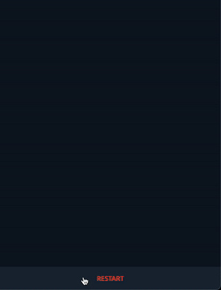
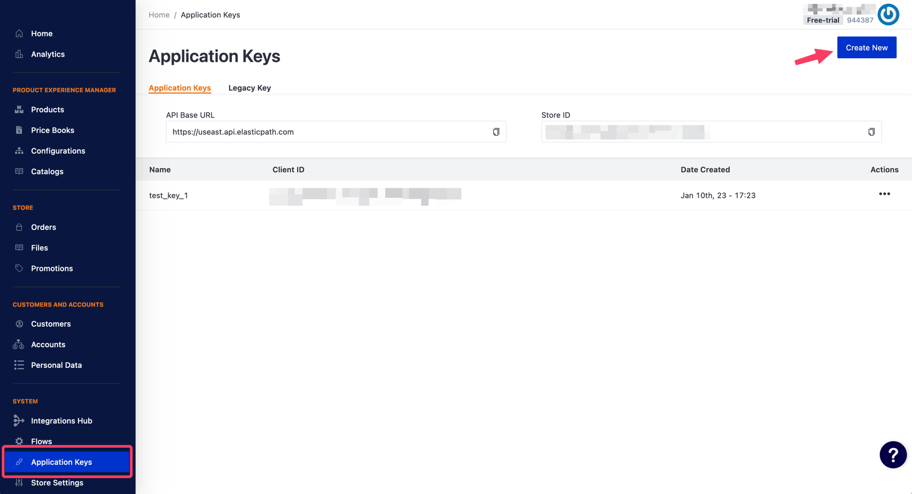

# FishStore Telegram bot



### How to install

```
git clone git@github.com:Gennadynemchin/FishStore.git
```

Use .env.example as a draft and fill all of the requested
variables:

```
CLIENT_ID=<ELASTICPATH_CLIENT_ID>
CLIENT_SECRET=<ELASTICPATH_CLIENT_SECRET>
STORE_ID=<ELASTICPATH_STORE_ID>
TG_TOKEN=<TELEGRAM_BOT_TOKEN>
```

Use elasticpath_token.example as a draft and remain it empty. The token will be stored here
automatically. Don't forget to rename it to elasticpath_token

- Get your Telegram bot token from https://t.me/BotFather
- Please visit https://elasticpath.com and create a free trial store or a regular store.
- Then you have to make a key:



- For more detailed information please read the docs:
https://documentation.elasticpath.com/commerce-cloud/docs/api/index.html

### How to start

Run in a terminal:
```
tgbot.py
```

### Deploy with Docker

1. Copy this repository to your server:
```
git clone https://github.com/Gennadynemchin/FishStore.git
```
2. `cd FishStore`
3. `nano .env.example`. Then fill all needed variables as shown above. 
Save edited file as `.env`;
4. `mv elasticpath_token.example elasticpath_token`
5. Build an image:
`docker build -t your-image-name . `
6. Then `docker run -d --restart always your-image-name`